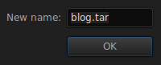
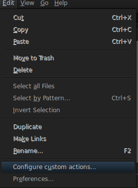
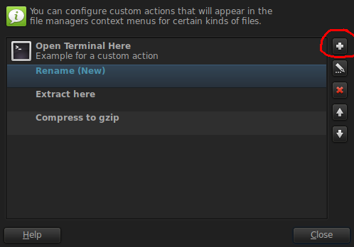
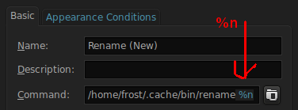
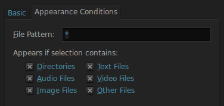
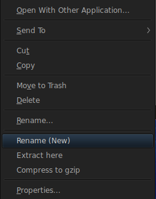

End the rename crashing saga in Thunar.

I've had enough crashed sessions caused by just trying to rename some file/directory in Thunar.

It's not like this problem started since 1.6.10, it's been for **awhile**.

The renaming will also be sanitezed. Only valid alphabets, numbers and some punctuation marks are allowed, everything else is discarded when the renaming starts.

## Compile

Run the command below to compile the program, move it in your $HOME/.cache dir. Backup the source code **main.c**.

```bash
# -Wundef -Wwrite-strings -Wcast-align -Wstrict-overflow=5 -W -Wshadow -Wconversion -Wpointer-arith -Wstrict-prototypes -Wformat=2 -Wmissing-prototypes 

gcc -Wall -Wextra -O2 main.c -o rename `pkg-config --cflags --libs gtk+-3.0`
```

## Configure

Open up Thunar, hover over the **Edit** section and select **Configure custom actions**



Click the \+ symbol to add a new custom action.



In the Name filed type **Rename (New)**, in the command field select/type the program location and append **%n** at the end.



Switch to the appearance tab, in the **File Pattern** filed type \* and toggle all the checkboxes.



Re-open Thunar, select some file/folder/zombie and right click to see and test the new Rename action.




Say goodbye to the rename crashing bug that's been with Thunar for so many years.

## Note

If your window manager is tiling, add exception to make this program floating and centered.
